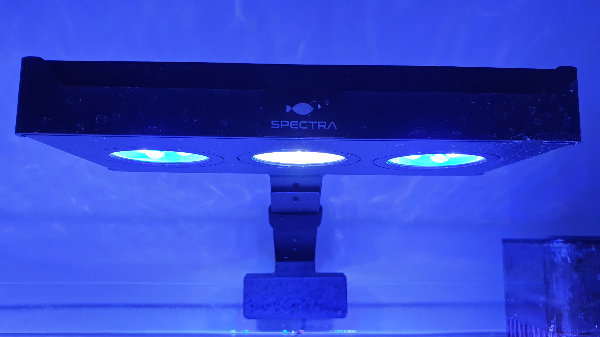
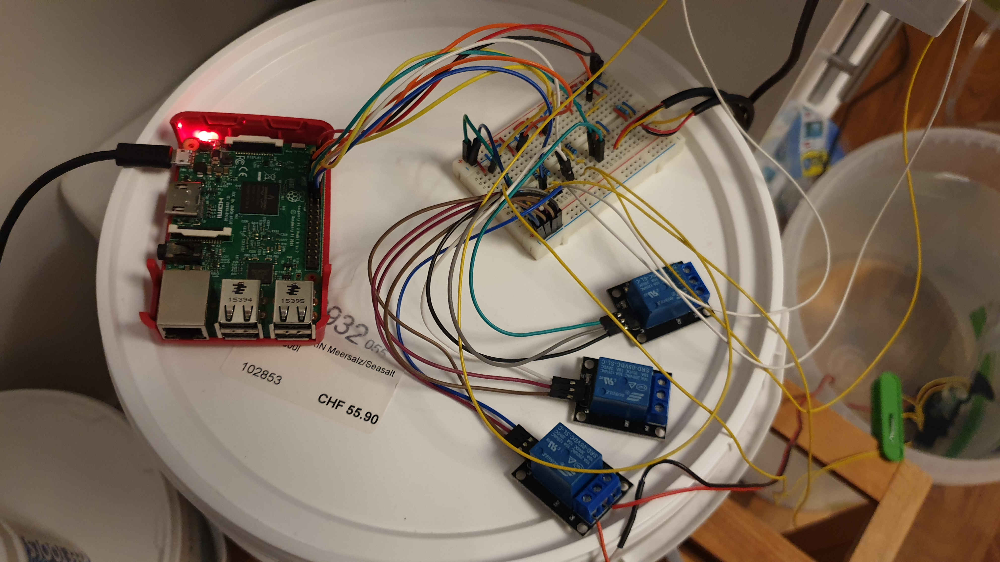

# IoT Engineering
## Project RaspberryReef


RaspberryReef is a prototype of a reef management system. One of its purposes is to manage the refill process of a reef aquarium. Salt concentration is an important part of reefing. The right amount of salt in the water helps every reef to be stable and healthy which is essential for all fish, corals and sea anemones. Therefore, evaporated water needs to be refilled quickly. RaspberryReef can get this job done. Furthermore, temperature is measured every five minutes and published to the web. Another critical success factor of every reef aquarium is light. Most corals have bacteria on them which turn light into sugar. The sugar is then consumed by the coral. Light can be controlled by RaspberryReef, too. The whole application is written in JavaScript with Node.js and runs on a Raspberry Pi 3 B+. All measurements and other GPIO values are published to the web.


## Introduction
This project is part of the [IoT Engineering](../../../fhnw-iot) course.

* 2-person teams, building an IoT system.
* 32 hours of work per person, 1 prototype.
* 10' presentation of the project at Demo Day.
* Slides, source code and setup steps on GitHub.
* Both team members are able to explain the project.

### Team members
* @jonathan-baettig & @jbaettig, Jonathan James Bättig

## Project setup
### Controller
My device of choice is a Raspberry Pi 3 B+ which I already had at home but have never really used until now. It runs Raspbian Buster Lite with Node.js and several node libraries.

#### Software setup
The following setup steps are required to successfully run RaspberryReef on a Raspberry Pi 3 B+.
* Enable SSH
* Enable Wi-Fi
* Install git
    * *sudo apt-get install git*
* Install Node.js
    * *wget https://nodejs.org/dist/v13.6.0/node-v13.6.0-linux-armv7l.tar.gz*
    * *tar -xzf node-v13.6.0-linux-armv7l.tar.gz*
    * *cd node-v13.6.0-linux-armv7l/*
    * *sudo cp -R * /usr/local/*
* Install Node libraries
    * ds18b20-rasp (1-Wire Temp. Sensor)
        * *npm i ds18b20-raspi*
        * https://www.npmjs.com/package/ds18b20-raspi
    * Node Fetch (Fetch API)
        * *npm i node-fetch*
        * https://www.npmjs.com/package/node-fetch
    * onoff (GPIO)
        * *npm install onoff*
        * https://www.npmjs.com/package/onoff
    * Twitter Lite (Twitter Library)
        * *npm i twitter-lite*
        * https://www.npmjs.com/package/twitter-lite
    * Nohub (Process Controller)
        * *npm i nohup -g*
        * https://www.npmjs.com/package/nohup
* Activate 1-Wire Sensor on Pi
    * *sudo nano /boot/config.txt* -> add line: *dtoverlay=w1–gpio*

### Sensors
Magnetic water level sensor. Activates when the floating ring has contact with the clamp.  
https://de.aliexpress.com/item/32909017788.html


Waterproof temperature sensor. Measures temperature in degree Celsius.  
https://de.aliexpress.com/item/33032061557.html


### Actuator

5v AC and DC Relay. Used to controll the refill pump and the led lights.  
https://de.aliexpress.com/item/32888878613.html


### Other hardware

12v DC refill pump with power plug and tube.  
https://de.aliexpress.com/item/32859196804.html  
https://de.aliexpress.com/item/33035018517.html


LED reef aquarium lamp.



Resistors in different sizes.  
https://de.aliexpress.com/item/32840627690.html


Connection wires.


Soldering iron and solder.


My Reef Aquarium.


### Hardware Wiring
Since I wanted to use the GPIO pins of my Raspberry Pi directly and without a grove base hat I needed to wire all the sensors and actuators by myself. For prototyping I used jumper cables, wires and a breadboard. The wiring diagram below represents my prototype. It was created with the Fritzing tool. The wiring diagram can be found here: [Fritzing/RaspberryReef.fzz](Fritzing/RaspberryReef.fzz). It includes the pin numbers of the pins used for each sensor and actuator.


Since my breadboard was smaller than the one I used in my Fritzing, the actual Device looks a little different. However, each sensor and actuator is connected to the Pi equally. The exact same GPIO pins are used.



## Deliverables
### Source code
The entire source code of my project is committed to this repository. All code is written in JavaScript with Node.js.

#### Main Application
* [Nodejs/RaspberryReef.js](Nodejs/RaspberryReef.js)

The configuraiton of RaspberryReef needs to be done in this file. The following lines of code may need to be changed:
```
// The UserId of the recipient of Twitter direct messages
var directMessageRecipient = TWITTER_USER_NUMBER;

// Sunrise and sunset time.
var initialSunrise = new Date(initialDate.getFullYear(), initialDate.getMonth(), initialDate.getDate(), SUNRISE_HOUR, SUNRISE_MINUTE, 0);
var initialSunset = new Date(initialDate.getFullYear(), initialDate.getMonth(), initialDate.getDate(), SUNSET_HOUR, SUNSET_MINUTE, 0);
```

#### Sensors
* [Nodejs/Sensors/TempSensor.js](Nodejs/Sensors/TempSensor.js)
* [Nodejs/Sensors/WaterLevelSensor.js](Nodejs/Sensors/TempSensor.js)

#### Actuators
* [Nodejs/Actuators/Relay.js](Nodejs/Actuators/Relay.js)

#### Timer
* [Nodejs/Timer/LightManager.js](Nodejs/Timer/LightManager.js)

#### Gateway
* [Nodejs/Gateway/ThingSpeakRestApi.js](Nodejs/Gateway/ThingSpeakRestApi.js)
* [Nodejs/Gateway/TwitterApi.js](Nodejs/Gateway/TwitterApi.js)


### Presentation
4-slide PDF presentation
* [Presentation/RaspberryReef.pdf](Presentation/RaspberryReef.pdf)

#### Use cases
RaspberryReef is a prototype of a reef management system. It fulfils the following use cases:
* Measure water temperature.
* Switch on / off reef aquarium led according to the time of the day.
* Automatically refill evaporated water.
* Send a direct message on Twitter if the refill bucket has not enough water.
* Display sensor and actuator data on ThingSpeak (https://thingspeak.com/channels/909274).

#### Reference model


#### Interface documentation
RaspberryReef has two interfaces to the world wide web. Both use https to send data either to ThingSpeak or to Twitter. Since Twitter authentication is quite complicated I used the twitter-lite Node.js library to get it done.

HTTP API to write ThingSpeak
```
$ curl -vX POST https://api.thingspeak.com/update.json --data 'api_key==WRITE_API_KEY&field1=TEMP_GROUND&field2=TEMP_SURFACE&field3=WATER_REEF_MIN&field4=WATER_REEF_MAX&field5=WATER_REFILL_MIN&field6=LAMP_LEFT_STATE&field7=LAMP_RIGHT_STATE&field8=REFILL_PUMP_STATE'
```

HTTP API to write Twitter DM
```
curl --request POST --url https://api.twitter.com/1.1/direct_messages/events/new.json --header 'authorization: OAuth oauth_consumer_key="CONSUMER_KEY", oauth_nonce="AUTO_GENERATED_NONCE", oauth_signature="AUTO_GENERATED_SIGNATURE", oauth_signature_method="HMAC-SHA1", oauth_timestamp="AUTO_GENERATED_TIMESTAMP", oauth_token="USERS_ACCESS_TOKEN", oauth_version="1.0"' --header 'content-type: application/json' --data '{"event": {"type": "message_create", "message_create": {"target": {"recipient_id": "RECIPIENT_USER_ID"}, "message_data": {"text": MESSAGE_TEXT}}}}'
```

#### Issues
During prototyping I faced the following issues:
* ThingSpeak only allows channel updates every 15 seconds. Therefore, I created a queue which stores the data that needs to be sent to ThingSpeak.
* Wiring the Pi was not that easy. I needed to read a lot about pull-up and pull-down resistors and when to use them. I also needed to learn when to use which resistor size.
* Since I wanted to work without the Grove base hat I needed to solder some wires which was completely new for me.
* Since I did not want to drill any holes into my reef tank, I needed to find another way of attaching my water level sensors to the tank. I finally found the perfect climbs for this in the spare parts from another tank.
* Sometimes RaspberryReef sent me direct messages on Twitter because the application measured that there is not enough water in the refill bucket. However, when I checked the amount of water in the bucket everything was fine. It took me hours to find the problem. The running refill pump created a magnetic field which was strong enough to trigger the magnetic switch of the water level sensor. I was able to solve this issue by positioning the sensor directly on top of the pump.
* I struggled a lot with the Twitter authentication. Twitter uses OAuth 1.0 and I somehow failed to get it working. My Postman request worked fine but I was not able to implement it in JS. I decided to use a library then.

### Live demo
#### Sensor input on a IoT device triggers an event.
Water level sensor detects that there is not enough water in the bucket. The Raspberry Pi triggers the refill process.
#### The event or measurement shows up online, in an app or web client.
Historical sensor and actuator values are published to the ThingSpeak channel of RaspberryReef. https://thingspeak.com/channels/909274
#### The event triggers actuator output on the same or on a separate IoT device.
The start of the refill process activates the relay actuator that controls the pump. After a few seconds the refill process stops because there is not enough water in the refill process and sends me a direct message on Twitter.

## Submission deadline
Commit and push to (this) project repo before Demo Day, _13.01.2020, 00:00_.
